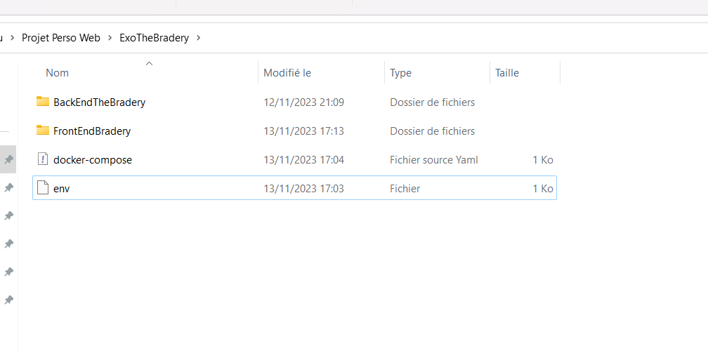

Prérequis: Node: https://nodejs.org/en ;  Docker-desktop: https://docs.docker.com/desktop/install/windows-install/ ;  Wampserver: https://www.wampserver.com/

Fonctionnement de Wampserver :
- Lancer Wampserver.
- Ouvrir phpMyAdmin.
- Importer la base de données (la base de données se trouve dans le dossier du backend : BackendTheBradery/db/backendbradery.sql).
- Installation Front-end : `npm install`, `npm run dev`.
- Installation Back-end : `npm install` et `npm start`.

Prérequis :

- Docker Desktop : https://docs.docker.com/desktop/install/windows-install/

Pour déployer avec Docker (Windows) :

- Créer un répertoire local sur votre machine.
- Cloner le front et le back dans ce même répertoire.
- Télécharger le fichier zip contenant le docker-compose.
- Déplacer le fichier zip vers le répertoire local.
- Dézipper le fichier.
- Lancer la commande "docker-compose up -d" pour déployer le site web.
- Enfin, accédez à l'URL : http://localhost:5000/

La disposition des fichiers doit se présenter ainsi: 

Pages créées :
- SignIn : pour la connexion et l'inscription (non fonctionnelle).
- Products : affiche tous les produits de la base de données et permet d'ajouter des produits dans le panier en cliquant sur "ajouter".
- ProductPayment : le panier affiche la liste des produits sélectionnés et permet d'augmenter la quantité de produits.
- Product : lorsque l'on clique sur un produit de la page "products", on est redirigé vers cette page qui affiche le produit seul mais ne permet pas de le rajouter au panier.

Fonctionnalités :
- Panier : Les utilisateurs doivent pouvoir ajouter des produits à leur panier, en respectant la limite de stock disponible.
- Page de Paiement : Une fois les produits ajoutés, les utilisateurs doivent pouvoir se diriger vers une page de paiement et passer une commande.
- Commandes : Après avoir passé une commande, une entrée doit être créée dans la base de données avec le prix total et chaque article de la commande. Le stock de produits doit également être mis à jour.

Docker Compose :
- MySQL
- Le Front
- Le Back